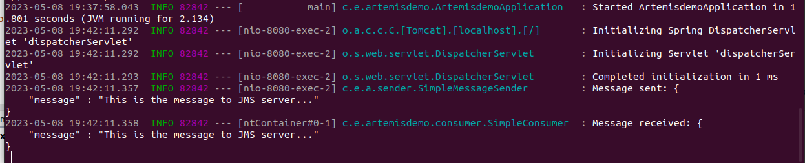

# Spring Boot JMS example

# Project Title

Simple overview how to use JMS in Spring Boot 2.x.

## Description

Spring Boot 2.7.11, REST, JMS, Lombok

## Getting Started

### Dependencies

* Java 11
* ActiveMQ Artemis 2.26.0

### Installing (Ubuntu 22.04)

1. Install Apache Artemis MQ server and set Java 11 to default JDK for the actual terminal
```
- Download tar.gz file from https://activemq.apache.org/components/artemis/download/ page after that extract the file
- sudo update-alternatives --config java (select Java 11)
- java -version
```
* Create message broker
```
- cd ARTEMIS_HOME/bin folder
- ./artemis create test-broker
- type the default username: artemis
- type the default password: artemis
- type "y" then press enter
```
* Start Artemis
```
/apache-artemis-2.26.0/bin/test-broker/bin/artemis-service start
```
* Check Artemis web console and login with default username and password
```
http://localhost:8161/console
```
* Create artemis-demo.jar
```
- gradle clean bootjar
```

### Executing program

* Run "artemis-demo" application
```
java -jar artemis-demo-1.0.0.jar
```
* Call REST endpoint to trigger send JMS message (e.g. Postman) 
```
POST http://localhost:8080/send
{
  "message": "This is the message ..."
}
```
* You can see in Spring Boot terminal the producer and the consumer services how communicate to each other.



## Author

Kenyeres Géza
https://hu.linkedin.com/in/g%C3%A9za-kenyeres-17341631
